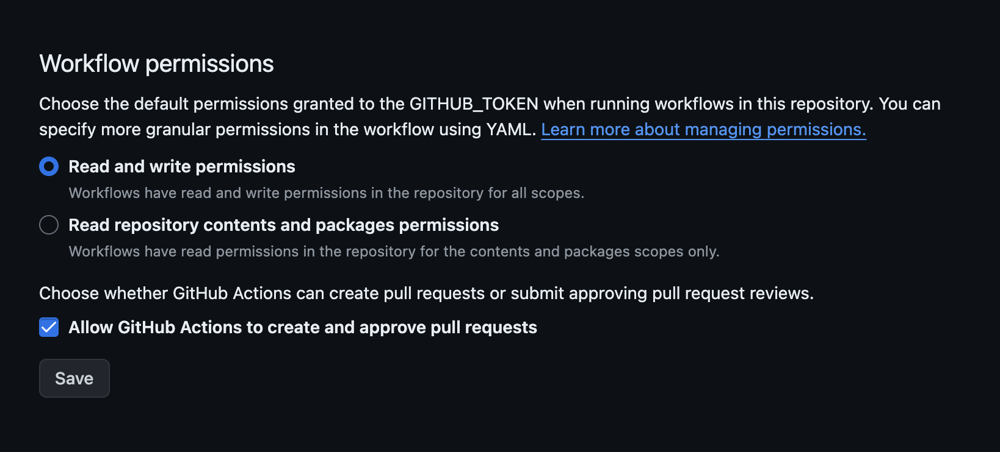
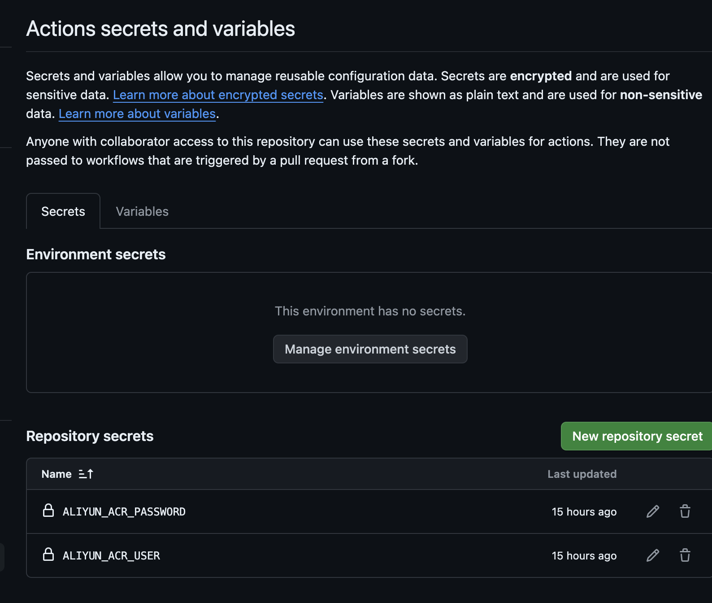

# push image to aliyun acr
## 0、说明
由于网络问题,国内下载有些镜像会失败。使用该github workflows脚本将镜像推送到阿里云ACR
下载镜像，具体的目标镜像信息可以从push.log中查看:

```
docker pull  registry.k8s.io/pause:3.9  
--->
docker pull registry.cn-shanghai.aliyuncs.com/sh-docker-images/centos:7
```

## 1、权限配置
### 1.1 Github Action权限配置
项目-->settings-->actions-->general-->Workflow permissions

### 1.2 阿里云ACR权限配置
略
### 1.3 github 配置ACR 用户/密码 secrets
项目-->settings-->Actions secrets and variables-->Actions--->Repository secrets

## 2、将镜像信息写入img-list.txt问中
## 3、github action中执行脚本,将镜像推送到阿里云ACR
